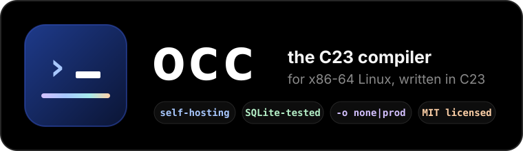
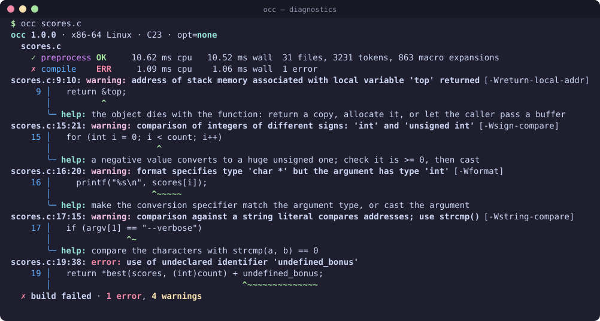
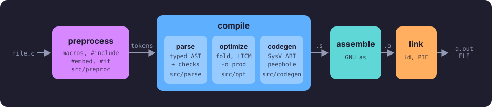
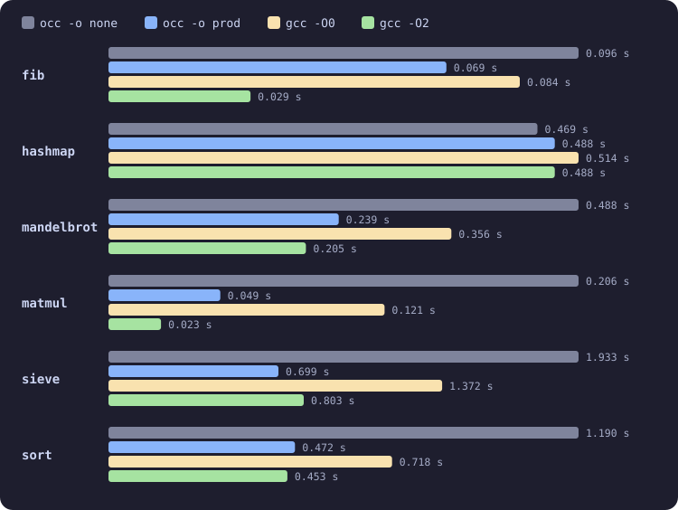

<div align="center">



</div>

<div dir="rtl" align="center">

**מהדר C23 ל-Linux על x86-64, שנכתב ב-C23 ומסוגל להדר את עצמו.**<br>
קדם-מעבד, מנתח תחבירי, מייעל ומחולל קוד משלו — ותהליך הידור שאפשר לעקוב אחריו.

</div>

<div align="center">

[](https://github.com/foxik38/opus-c-compiler/actions/workflows/ci.yml)


[](THINKPROC.md)

[English](README.md) · [Čeština](README.cs.md) · [Magyar](README.hu.md) · **עברית**



</div>

<div dir="rtl">

## תוכן העניינים

[יתרונות עיקריים](#יתרונות-עיקריים) · [התחלה מהירה](#התחלה-מהירה) · [שימוש](#שימוש) · [הודעות אבחון](#הודעות-אבחון) ·
[איך זה עובד](#איך-זה-עובד) · [ביצועים](#ביצועים) · [נבדק על קוד אמיתי](#נבדק-על-קוד-אמיתי) ·
[תמיכה ב-C23](#תמיכה-ב-c23) · [בדיקות](#בדיקות) · [נבנה על ידי Claude](#נבנה-על-ידי-claude)

## יתרונות עיקריים

- 🧩 **כל שלבי ההידור** — הקדם-מעבד, המנתח התחבירי ובודק הטיפוסים, המייעל ומחולל הקוד
  ל-x86-64 הם של occ עצמו; את הצעד האחרון מבצעים `as` ו-`ld` של GNU, ש-occ מפעיל ישירות.
- 📺 **הידור שאפשר לעקוב אחריו** — כל שלב מדווח `OK` או `ERR`, זמן מעבד וזמן אמיתי, ומה הוא יצר.
  במסוף, השלבים מונפשים בזמן הריצה והסיכום מראה לאן הלך הזמן.
- 🩺 **הודעות אבחון שעוזרות** — הודעות בסגנון GCC עם קטע מקוד המקור, רמז `help:` לטעויות
  הנפוצות, ו-27 אזהרות בעלות שם שמתמקדות בהתנהגות לא מוגדרת ובתכונות מיושנות.
- 🚀 **שתי רמות ייעול** — `-o none` מפיק קוד שנכונותו ברורה, ו-`-o prod` מוסיף הקצאת אוגרים, מצבי
  מיעון, קיפול קבועים, הפחתת עוצמת פעולות, הוצאת קוד קבוע מלולאות, טבלאות קפיצה ומעבר peephole.
  בקוד עתיר לולאות הוא מתקרב ל-`gcc -O2`.
- ✨ **C23** — `constexpr`, `auto`, `typeof`, `nullptr`, `bool`, `#embed`, מאפיינים (attributes),
  `<stdckdint.h>`, טיפוסי מנייה עם טיפוס בסיס קבוע, מפרידי ספרות ועוד.
- 🧪 **נבחן על תוכניות אמיתיות** — SQLite, Lua, zlib, Duktape ואחרים נבנים עם occ ועוברים את
  הבדיקות שלהם; occ מהדר את עצמו עד לנקודת שבת (bootstrap fixpoint).

## התחלה מהירה

לבנייה הראשונה צריך מהדר C23 (או C2x; נבדק עם GCC 13 ו-Clang 18), את GNU binutils ואת קובצי
הפיתוח של glibc — כלומר `build-essential` ב-Debian/Ubuntu ו-`base-devel` ב-Arch.

</div>

```sh
make                          # builds ./occ
make test                     # every test at -o none and -o prod
sudo make install             # /usr/local/bin/occ (+ its headers in /usr/local/lib/occ)

occ examples/hello.c --run    # build and run
occ -o prod examples/life.c && ./life 30
```

<div dir="rtl">

## שימוש

</div>

```text
occ [options] <file>...
```

<div dir="rtl">

הקלט יכול להיות קובצי `.c` (מהודרים), `.s` (מועברים לאסמבלר), וקובצי `.o` ו-`.a` (מקושרים).

> [!NOTE]
> ב-occ, **`-o` בוחר את רמת הייעול** ו-**`-n` קובע את שם הפלט** — הפוך מ-GCC.

| אפשרות | משמעות |
|---|---|
| `-o none` \| `-o prod` | רמת הייעול. ברירת המחדל היא `none`; `prod` הוא קוד מוכן לייצור (≈ `-O1`/`-O2` של GCC). גם `-O0`…`-O3` מתקבלים ככינויים. |
| `-n <name>` | שם קובץ הפלט. ברירת מחדל: שם קובץ המקור הראשון בלי הסיומת. |
| `-E` / `-S` / `-c` | עצירה אחרי הקדם-מעבד / אחרי ההידור (`.s`) / אחרי האסמבלר (`.o`). |
| `--run [-- args]` | הרצת התוכנית אחרי הבנייה. |
| `--keep` | שמירת קובצי הביניים `.s` ו-`.o`. |
| `-I <dir>`, `-iquote <dir>` | הוספת תיקייה לחיפוש של `#include <...>` / `"..."`. |
| `-D <name>[=val]`, `-U <name>` | הגדרה / ביטול של מאקרו. |
| `-l <lib>`, `-L <dir>` | קישור ספרייה / הוספת תיקיית ספריות (`libm` מקושרת אוטומטית, ורק אם יש בה צורך). |
| `--static`, `-rdynamic` | קישור סטטי / ייצוא כל הסמלים עבור תוספים שנטענים עם `dlopen()`. |
| `-w`, `-Werror`, `-W<name>`, `-Wno-<name>` | שליטה באזהרות; `--warnings` מציג את כולן. |
| `-q`, `-v` | שקט (רק הודעות אבחון) / מפורט (מציג גם את הפקודות של `as` ו-`ld`). |
| `--color`, `--no-color` | כפיית צבעים או כיבויים (ברירת מחדל: כש-stderr הוא מסוף, בכפוף ל-`NO_COLOR`). |

משתני סביבה: `OCC_AS`, `OCC_LD` ו-`OCC_CC` מחליפים את הכלים ש-occ מריץ, `OCC_LINK_WITH_CC=1`
מקשר דרך `cc` במקום לקרוא ל-`ld` ישירות, ו-`OCC_NO_ANIMATION=1` מבטל את ההנפשה במסוף. כש-stderr
אינו מסוף, הפלט הוא טקסט פשוט, שורה אחת לכל שלב.

## הודעות אבחון

כשמשהו משתבש, השלב שנכשל מסומן ב-`ERR` ואחריו מגיעות הודעות האבחון — כל אחת עם המיקום, שורת
קוד המקור, שם האזהרה, ובמקום שהתיקון ברור — גם רמז:

</div>

<div align="center">

</div>

<div dir="rtl">

השורה הראשונה של כל הודעה שומרת על הפורמט של GCC‏ `file:line:col: warning:`, כך שעורכים וכלי
בנייה מבינים אותה. כל האזהרות פעילות כברירת מחדל; אלה שמסומנות **UB** מתריעות על קוד שתקן C
משאיר את התנהגותו לא מוגדרת.

<details>
<summary><b>כל 27 האזהרות</b> (<code>occ --warnings</code>)</summary>

| אזהרה | מה היא מזהה |
|---|---|
| `unused-variable` | משתנה מקומי שאף פעם לא נעשה בו שימוש (או שרק מציבים בו ערך) |
| `unused-function` | פונקציה סטטית שאף פעם לא נעשה בה שימוש |
| `unused-value` | תוצאת ביטוי שמחושבת ונזרקת |
| `unused-result` | התעלמות מהתוצאה של פונקציה עם `[[nodiscard]]` |
| `uninitialized` | משתנה שנקרא אבל אף פעם לא נכתב — **UB** |
| `parentheses` | השמה שמשמשת כתנאי |
| `empty-body` | גוף ריק ל-`if`/`while`/`for` (נקודה-פסיק תועה) |
| `div-by-zero` | חילוק שלמים באפס קבוע — **UB** |
| `shift-count` | הזזה בכמות שלילית או ברוחב הטיפוס ומעלה — **UB** |
| `overflow` | קבוע שגולש או משנה את ערכו בהמרה |
| `array-bounds` | אינדקס קבוע מחוץ לגבולות המערך — **UB** |
| `null-dereference` | גישה דרך מצביע null קבוע — **UB** |
| `return-local-addr` | החזרת הכתובת של משתנה מקומי — **UB** |
| `return-type` | פונקציה שמחזירה ערך מגיעה לסופה בלי `return` — **UB** |
| `format` | תבנית `printf`/`scanf` שלא מתאימה לארגומנטים — **UB** |
| `sign-compare` | השוואה בין שלמים עם סימן ובלי סימן |
| `int-conversion` | המרה מרומזת בין מצביע למספר שלם |
| `incompatible-pointer-types` | המרה מרומזת בין טיפוסי מצביעים לא תואמים |
| `discarded-qualifiers` | המרה מרומזת שמשמיטה `const`/`volatile` |
| `string-compare` | השוואה למחרוזת מילולית בעזרת `==` או `!=` |
| `sizeof-array-argument` | שימוש ב-`sizeof` על פרמטר מסוג מערך |
| `deprecated` | שימוש בתכונות מיושנות, מוצאות משימוש או לא בטוחות |
| `multichar` | קבוע תו שמורכב מכמה תווים |
| `main` | הצהרה חשודה של `main` |
| `macro-redefined` | מאקרו שהוגדר מחדש עם גוף אחר |
| `cpp` | הנחיית `#warning` |
| `unsupported` | תכונה שמתקבלת אבל occ מממש אותה רק בקירוב |

תכונות שהוסרו מהשפה הן שגיאות של ממש: `int` מרומז והצהרות פונקציה מרומזות (הוסרו ב-C99),
`gets()` (הוסרה ב-C11) והגדרות פונקציה בסגנון K&R (הוסרו ב-C23).

</details>

## איך זה עובד

</div>

<div align="center">

</div>

<div dir="rtl">

המנתח התחבירי בונה AST עם טיפוסים מלאים, שבו כל המרה מרומזת היא המרה מפורשת, כך שמחולל הקוד
לא צריך לגלות מחדש את כללי ההמרה של C. ‏`-o none` הוא מכונת מחסנית פשוטה עם צובר — נכונה באופן
מובהק, והיא נקודת הייחוס שמולה נבדק `-o prod`. ‏`-o prod` שומר על אותו שלד ומסיר רק את התקורה שלו:

| | `-o none` | `-o prod` |
|---|---|---|
| משתנים | על המחסנית | סקלרים ב-`%rbx`, `%r12`–`%r15`; `double`/`float` ב-`%xmm12`–`%xmm15` |
| ערכי ביניים | `push`/`pop` | אוגרי עזר `%r8`–`%r11`, `%xmm8`–`%xmm11` |
| גישה לזיכרון | כתובת ב-`%rax` ואז טעינה | אופרנדים `disp(base, index, scale)`, קריאה-שינוי-כתיבה, כתיבת קבועים ישירה |
| בקרת זרימה | בדיקה בתחילת הלולאה | לולאות עם בדיקה בסוף, `cmp`+`jcc` ישירים, טבלאות קפיצה ל-`switch` צפוף |
| מעברים על ה-AST | — | קיפול קבועים, זהויות אלגבריות, הפחתת עוצמה, ענפים מתים, הוצאת קוד קבוע מלולאות |
| ניקוי | — | מעבר peephole |

</div>

```text
src/
├── support/   vectors, strings, hash map, source files, diagnostics, timers
├── preproc/   lexer, macro expansion (Prosser hidesets), directives, #if evaluation
├── parse/     declarations, expressions, statements, initializers, types, scopes,
│              constant evaluation, and the static checker behind most warnings
├── opt/       -o prod AST passes: folding and simplification, loop-invariant code motion
├── codegen/   expressions, statements, calls and the SysV ABI, data, registers, peephole
└── driver/    command line, pipeline, live status display, external tools
include/       freestanding headers occ provides (stddef.h, stdarg.h, stdckdint.h, ...)
examples/      small programs to try          tests/   runtime, diagnostic, benchmark, fuzz
```

<div dir="rtl">

למה occ בנוי כך — ומה השתבש בדרך — מתואר ב-[**THINKPROC.md**](THINKPROC.md) (באנגלית).

## ביצועים

התוצאה הטובה מבין 3 הרצות של מדדי הביצועים שב-[`tests/bench`](tests/bench) ‏(`make bench`; כל
הגרסאות מדפיסות את אותו סכום ביקורת). עמודה קצרה יותר פירושה קוד מהיר יותר.

</div>

<div align="center">

</div>

<div dir="rtl">

`-o prod` מהיר מ-`gcc -O0` בכל המדדים, ובארבעה מתוך שישה הוא נמצא בטווח של 20% מ-`gcc -O2`.
הפער שנותר הוא בקוד עם הרבה קריאות לפונקציות (`fib`: ‏occ לא מבצע inlining) ובלולאות שאפשר
לבצע להן וקטוריזציה (`matmul`). גם בתוכנית אמיתית וגדולה התמונה דומה: `speedtest1` של SQLite
רץ 1.74 שניות כשהוא בנוי עם `occ -o prod`, ‏4.19 שניות עם `-o none` ו-0.90 שניות עם `gcc -O2`.
המדידות נעשו על מכונה משותפת, ולכן יש לצפות לרעש של כ-±10%.

## נבדק על קוד אמיתי

הפרויקטים האלה נבנו עם occ בשתי רמות הייעול ונבדקו בעזרת הבדיקות שלהם (או בית אחר בית מול
בנייה של אותו קוד עם GCC):

| פרויקט | גודל | התוצאה עם `-o none` ועם `-o prod` |
|---|---:|---|
| [SQLite](https://sqlite.org) 3.53 + shell | ‏307 אלף שורות | עומס SQL זהה לבנייה של GCC; גיבוב האימות של `speedtest1` זהה |
| [Lua](https://www.lua.org) 5.4.9 | ‏30 אלף שורות | סקריפט בדיקה: פלט זהה |
| [Duktape](https://duktape.org) 2.7 | ‏108 אלף שורות | סקריפט בדיקה ב-JavaScript: פלט זהה |
| [MuJS](https://mujs.com) 1.3.9 | ‏20 אלף שורות | סקריפט בדיקה ב-JavaScript: פלט זהה |
| [Jim Tcl](https://jim.tcl.tk) 0.83 | ‏43 אלף שורות | חבילת הבדיקות שלו: 5551 מתוך 5729 עוברות — בדיוק כמו עם GCC |
| [zlib](https://zlib.net) 1.3.2 | ‏25 אלף שורות | `example` עובר; הפלט של `minigzip` זהה בית אחר בית לזה של GCC |
| [bzip2](https://sourceware.org/bzip2/) 1.0.8 | ‏8 אלף שורות | הדוגמאות של `make test` עוברות; הפלט זהה בית אחר בית לזה של GCC |
| [LZ4](https://lz4.org) 1.10 | ‏18 אלף שורות | רמות 1/9/12 זהות לפלט של GCC, דחיסה ופריסה תקינות |
| [xxHash](https://xxhash.com) 0.8.3 | ‏12 אלף שורות | בדיקת השפיות: כל 49948 הווקטורים עוברים; כל ארבע פונקציות הגיבוב תואמות |
| [Csmith](https://github.com/csmith-project/csmith) | אקראי | יותר מ-500 תוכניות שנוצרו; שני ההבדלים מ-GCC היו באגים, שכבר תוקנו |

כל אחת מההרצות האלה מצאה או אישרה משהו: הבנייה של Lua חשפה שתי אזהרות שווא, xxHash — באג
בקדם-מעבד, Jim Tcl — אפשרות `-rdynamic` חסרה, ו-Csmith — קידום שגוי של שדות סיביות והתעלמות מ-`#pragma pack`. הכול תוקן
ומוגן בבדיקות רגרסיה.

## תמיכה ב-C23

<details open>
<summary>מה נתמך</summary>

- אובייקטי `constexpr`, הסקת טיפוס עם `auto`,‏ `typeof` / `typeof_unqual`
- `nullptr` / `nullptr_t`,‏ `bool` / `true` / `false` כמילים שמורות
- מנייה עם טיפוס בסיס קבוע (`enum e : uint8_t`)
- מאפיינים: `[[nodiscard]]`, `[[deprecated]]`, `[[fallthrough]]`, `[[maybe_unused]]`,
  `[[noreturn]]`, `[[unsequenced]]`, `[[reproducible]]`
- `#embed`,‏ `#elifdef` / `#elifndef`,‏ `#warning`,‏ `__has_include`,‏ `__has_embed`,
  `__has_c_attribute`,‏ `__VA_OPT__`
- `static_assert` בלי הודעה, מאתחלים ריקים `= {}`
- `#pragma pack` ו-`__attribute__((packed, aligned))`, עם פריסה בזיכרון זהה לזו של GCC
- מספרים בינאריים ומפרידי ספרות (`0b1010'0101`)
- תוויות לפני הצהרות ובסוף בלוקים
- פרמטרים ללא שם בהגדרות, ו-`f()` במשמעות `f(void)`
- חשבון מבוקר עם `<stdckdint.h>` (מדויק לכל צירוף של טיפוסי אופרנדים),‏ `unreachable()`, קבועי
  תו `u8`
- כל מה שמצפים לו מ-C99/C11: מאתחלים עם ייעוד, ליטרלים מורכבים, מערכים גמישים בסוף מבנה, מבנים
  ואיחודים אנונימיים,‏ `_Generic`,‏ `_Alignas`/`_Alignof`,‏ `_Thread_local`, פונקציות עם מספר
  ארגומנטים משתנה, שדות סיביות,‏ `setjmp`/`longjmp`, העברה והחזרה של מבנים לפי ערך (SysV ABI)

</details>

<details>
<summary>מה (עדיין) לא</summary>

- מערכים באורך משתנה (VLA) — נדחים עם שגיאה (אופציונליים מאז C11)
- `_BitInt(N)`,‏ `_Complex`, נקודה צפה עשרונית
- `long double` מהודר כ-`double`;‏ `_Atomic` מתקבל בלי סמנטיקה אטומית (על שניהם מדווח
  `-Wunsupported`)
- ביטויי הוראה (statement expressions) של GNU ו-`asm` מורחב (`asm("...")` בסיסי עובד)
- יעדים שאינם Linux על x86-64 עם glibc — בכוונה

</details>

סיור בתכונות החדשות נמצא ב-[`examples/c23_tour.c`](examples/c23_tour.c).

## בדיקות

</div>

```sh
make test                   # runtime + diagnostic tests, at -o none and -o prod
tests/run.sh --reference    # validate the runtime tests themselves with GCC
make selfhost               # occ builds occ; stage 1 and 2 must emit identical assembly
make fuzz FUZZ_COUNT=1000   # random UB-free programs, occ vs GCC
tests/fuzz/csmith.py        # Csmith-generated programs, occ vs GCC (needs csmith)
make bench                  # the chart above
```

<div dir="rtl">

בדיקות האבחון מחמירות בשני הכיוונים: כל אזהרה צפויה חייבת להופיע, וכל אזהרה ש-occ מדפיס חייבת
להיות צפויה. ה-CI מריץ את כל אלה בכל push.

## נבנה על ידי Claude


את occ תכנן, כתב, בדק ותיעד Claude (מודל הבינה המלאכותית של Anthropic), שמנהל את המאגר הזה: כל
commit, כל בדיקה וכל עמוד תיעוד. השיקולים מאחורי התכנון, הבאגים שנמצאו בדרך ואיך הם התגלו
מתוארים ב-[THINKPROC.md](THINKPROC.md).

<br clear="right">

## תרומה לפרויקט

התרומה החשובה ביותר היא דיווח על באג — ובמיוחד תוכנית C ש-occ מהדר אחרת מ-GCC. הפרטים
ב-[CONTRIBUTING.md](CONTRIBUTING.md), ויש גם [יומן שינויים](CHANGELOG.md) ו-[מדיניות אבטחה](SECURITY.md) (באנגלית).

## רישיון

[MIT](LICENSE)

</div>
